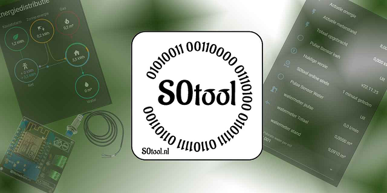
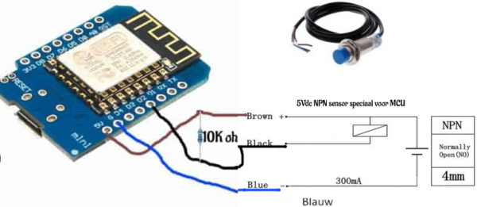
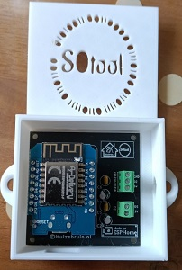
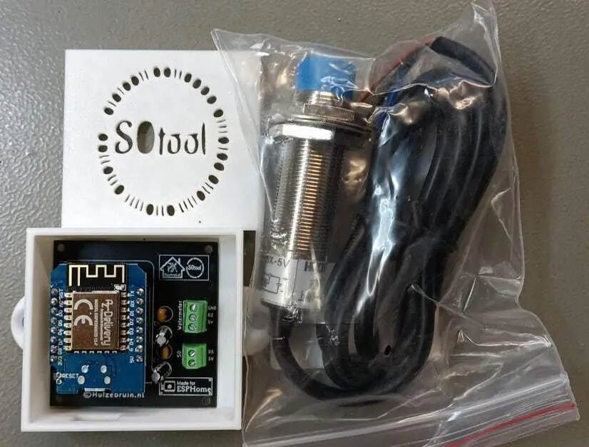

## Description

### What is the S0tool?

The **S0tool** is a small device that counts pulses from water or electricity meters. It works with **ESPHome** and can be used in **Home Assistant**. The S0tool connects to meters that use either an **NPN pulse output** or an **S0 interface**.

It can help you track how much water or electricity you use. This is useful for keeping an eye on your consumption, spotting problems like leaks, or just collecting data for automation.

---

### Key Features

- Works with ESPHome and Home Assistant  
- Supports water meters with NPN output  
- Supports energy meters with S0 output  
- Small and easy to mount  
- Suitable for DIY installations

---
If your meter supports **S0** or **NPN pulse output**, it should work with the S0tool.
### 💧 Compatible Water Meters (NPN Output)

| Brand      | Model         | Compatibility | Location |
|------------|---------------|----------------|----------|
| Elster     | V200          | ✅ Compatible   | NL       |
| Itron      | Aquadis+      | ✅ Compatible   | NL       |
| Sensus     | 620           | ✅ Compatible   | NL       |
| Maddalena  | CD SD Plus    | ✅ Compatible   | BE       |
| Actaris    | Single-Jet    | ✅ Compatible   | NL       |
| Zenner     | MNK-RP-N      | ✅ Compatible   | DE       |
| Kamstrup   | Multical 21   | ✅ Compatible   | EU       |
| Diehl      | Hydrus        | ✅ Compatible   | EU       |

To ad your Watermeter to the [list](https://github.com/huizebruin/s0tool/discussions/57).
---

### ⚡ Compatible Power Meters (S0 Output)

These meters have a standard **S0 pulse output** (open collector) and work with the S0tool:

| Brand        | Model                 | Compatibility | Notes                            |
|--------------|------------------------|----------------|----------------------------------|
| Eastron      | SDM120 / SDM220        | ✅ Compatible   | S0 pulse terminals               |
| ABB          | B23 / B24 series       | ✅ Compatible   | External S0 wiring required      |
| Schneider    | iEM3000 series         | ✅ Compatible   | Needs S0 connection setup        |
| Carlo Gavazzi| EM24 / EM340           | ✅ Compatible   | Pulse settings configurable      |
| Finder       | 7E.23 / 7E.36 series   | ✅ Compatible   | DIN rail mountable               |
| Eltako       | DSZ15D-3x80A           | ✅ Compatible   | DIN rail mountable               |

- S0 port kWh meter to the [list](https://github.com/huizebruin/s0tool/discussions/250)
---

### Hardware Requirements

- **Wi-Fi**: 2.4GHz (IEEE 802.11 b/g/n)  
- **ESPHome**: version 2024.12.x or newer  
- **Home Assistant**: version 2025.01.x or newer  
- **Board**: Wemos D1 mini V1 or V3.0 (ESP8266)  
- **Power**: USB cable + 5V/1A USB power supply

---

## Mounting

Place the NPN sensor above the water meter’s spinning wheel. Align it with the metal part on the wheel. Make sure the sensor stays in place and detects pulses correctly.

---

## Quickstart

1. Connect the S0tool to USB power  
2. Join the "s0tool Hotspot" Wi-Fi network  
3. Enter your Wi-Fi details  
4. Open Home Assistant and look for new devices

---

## Links

- [Shop (NL/BE)](https://huizebruin.nl/shop)  
- [GitHub](https://github.com/huizebruin/s0tool)  
- [Wiki](https://s0tool.nl)  
- [Website](https://s0tool.nl)

---

## Diy Product Images

### DIY Water Counter

To make a simple water counter, use a **Wemos D1 mini**, an **NPN sensor**, and a **10K resistor**. Connect the 10K resistor between **5V and D2**, and wire the NPN sensor between **D2 and GND**.

### DIY kWh Counter

To make a simple kWh counter, use a **Wemos D1 mini**, an **kWH meter with a s0 port**, and a **10K resistor**. Connect the 10K resistor between **GND and D5**, and wire the s0 port between **D5 and 5V**.

## Product Images

